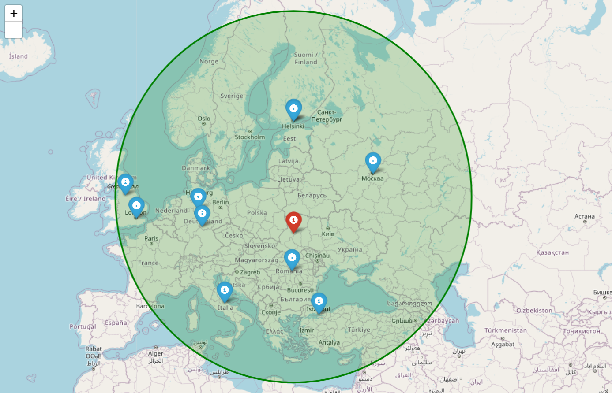
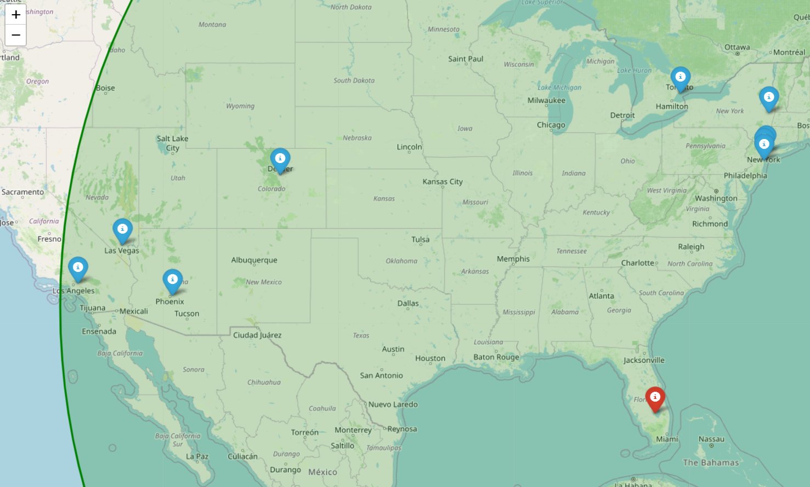

# MovieNear

Program draw points on map with locations of nearest filming places.


## Description

Generated map will contain 3 layers:
- Map layer.
- Markers layer(**blue** - films, **red** - user position).
- Radius layer. Draws circle that contains all markers.

We can use map to explore places that were filmed.
## Usage/Examples

```bash
python main.py 2005 50 25 locations_shrinked.list
```
Also, you can use optional parameter ```--destination``` to set your own name for the map. Default: ```Map.html```.
```bash
python main.py 2007 27 -81 locations_shrinked.list --destination=MyMap.html
```

File ```dataset_shrinker.py``` contains function ```shrink_dataset``` that can shrink dataset file. It can be useful if you want to use smaller dataset for testing.
```locations_shrinked.list``` is a dataset file that was shrinked by ```shrink_dataset```.
Original dataset file: [```locations.list```](https://drive.google.com/file/d/11KVCDMVb8H0vKzb8bx7VvqOlBUxUfL6x/view).


## Screenshots

Screenshots for examples above.





## License

[MIT](https://choosealicense.com/licenses/mit/)


## Authors

- [@mvysotskyi](https://www.github.com/mvysotskyi)